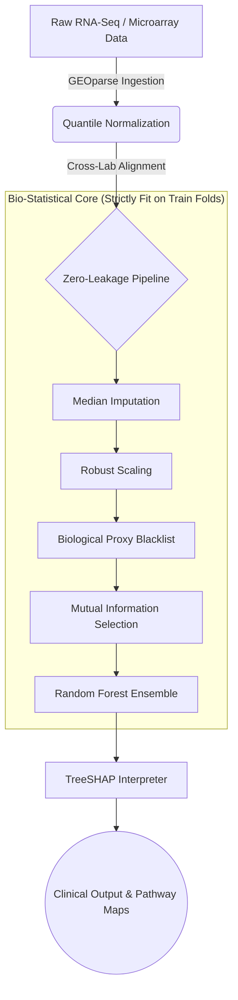

# CytoGraph-ML

[](https://doi.org/10.5281/zenodo.1234567)
[](https://opensource.org/licenses/MIT)
[](https://www.python.org/downloads/)
[](manuscript.tex)

CytoGraph-ML implements preprocessing, feature selection, classification, explainability, and cross-cohort validation procedures for transcriptomic cancer classification. It is specifically designed to address cross-platform domain shifts (technical batch effects) and prevent patient-level data leakage inside high-dimensional transcriptomic pipelines.

---

## 🛡️ Leakage-Aware Architecture

Standard linear pipelines leak information when normalization or feature selection is fit globally. CytoGraph-ML uses a strictly segmented fit-transform architecture to enforce fold-boundary isolation:



---

## ⚡ Quick Start

To replicate all cross-validation scores, external validation tests, permutation audits, ablation sweeps, and generate publication-ready figures:

```bash
# Clone the repository
git clone https://github.com/fs0cietyx/CytoGraph-ML.git
cd cytograph-ml

# Set up virtual environment
python3 -m venv venv
source venv/bin/activate  # On Windows: venv\Scripts\activate

# Install dependencies
pip install -r requirements.txt

# Run full reproduction pipeline
python scripts/reproduce_paper.py
```

---

## 📊 Data Availability

This framework evaluates model generalizability and batch effect tolerance across three Gene Expression Omnibus (GEO) microarrays:
- **GSE10072**: Primary training cohort (Platform GPL96)
- **GSE19804**: External validation cohort (Platform GPL570)
- **GSE21510**: External colorectal tissue shift cohort (Platform GPL570)

*Note: Raw transcriptomic datasets are not redistributed inside this repository due to licensing and file size. The pipeline automatically ingests local raw files cached under `data/raw/` when reproducing.*

---

## 📈 Expected Results

- **Expected CV Accuracy:** `97.78%`
- **Expected External Accuracy:** `50.00%` (Unaligned Baseline) / `85.83%` (Domain-Aligned Model)

---

## 📁 Repository Structure

```text
cytograph-ml/
├── configs/             # YAML configurations (Never hardcode parameters)
├── data/                # Separated raw, processed, and metadata schemas
├── notebooks/           # Exploratory work only
├── src/                 # Framework core modules
│   ├── preprocessing/   # Single-responsibility data operations
│   ├── models/          # Model factory and base wrappers
│   ├── pipelines/       # Scikit-learn Pipeline builders
│   ├── validation/      # Validation protocols (GroupKFold, permutation, etc.)
│   ├── explainability/  # SHAP calculations and pathway rollups
│   ├── evaluation/      # Standard clinical metrics
│   ├── visualization/   # Publication-ready plotting scripts
│   └── utils/           # Shared IO and logging utilities
├── tests/               # Pytest unit and leakage boundary tests
├── docs/                # Extended markdown documentation
├── results/             # Auto-generated CSVs and raw reports
├── figures/             # Final paper-ready figures
├── models/              # Serialized joblib pipelines
└── scripts/             # Entrypoint scripts for paper reproduction
```

---

## 📖 Citation

If you use this framework or reproduction codebase in your research, please cite:

```bibtex
@software{biswas2026cytograph,
  author       = {Mainak Biswas},
  title        = {CytoGraph-ML: Leakage-aware explainable machine learning framework for transcriptomic cancer classification},
  year         = {2026},
  publisher    = {GitHub},
  journal      = {GitHub Repository},
  howpublished = {\url{https://github.com/fs0cietyx/CytoGraph-ML}}
}
```

---

## ⚠️ Clinical Disclaimer
**FOR RESEARCH USE ONLY (RUO). NOT FOR USE IN DIAGNOSTIC PROCEDURES.**
CytoGraph-ML is a scientific research prototype. It has not been approved by the FDA or any other regulatory body. Under no circumstances should this software be used to diagnose, treat, or monitor any patient.
