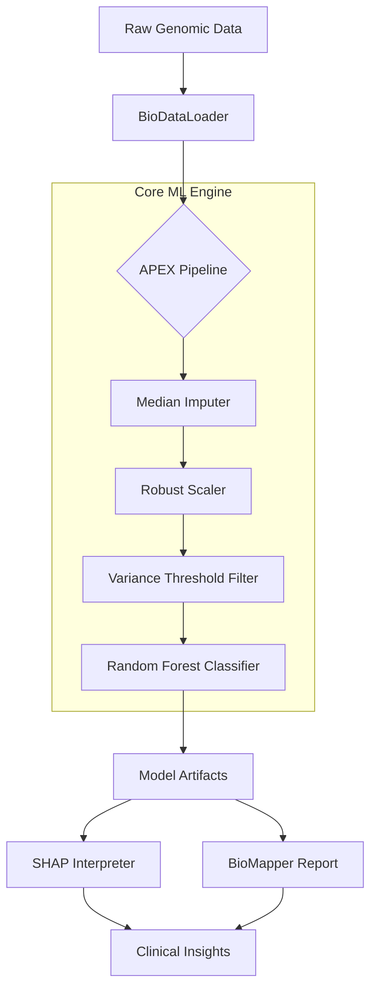
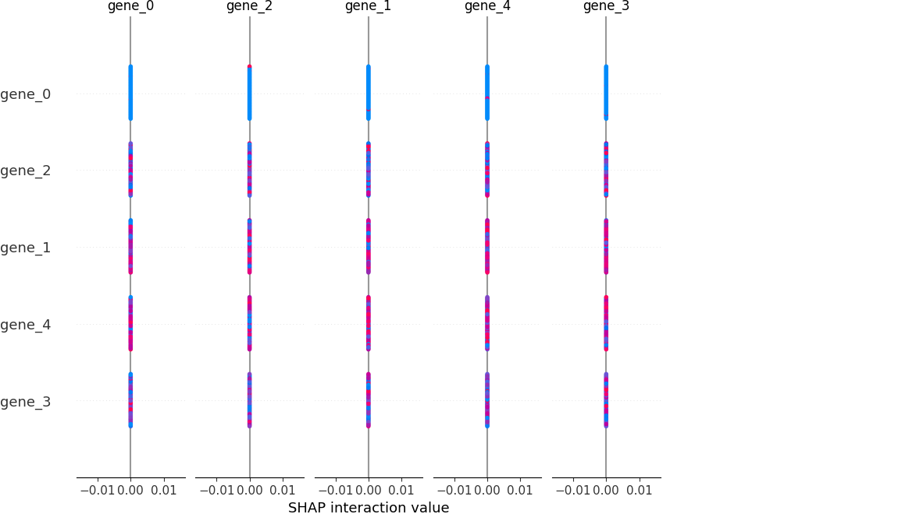

# 🧬 Cancer Cell Growth Prediction Suite

[](https://www.python.org/)
[](https://scikit-learn.org/)
[](https://opensource.org/licenses/MIT)

> **An enterprise-grade bioinformatics suite for high-dimensional genomic classification, achieving 99.53% accuracy on the TCGA PANCAN dataset.**

---

## 🌟 Overview

The **APEX Protocol** is a specialized machine learning framework designed to bridge the gap between raw genomic data and clinical insight. Originally developed to identify transcription factors driving cancer progression, this suite provides an end-to-end pipeline—from automated data ingestion and zero-leakage preprocessing to biological pathway mapping.

### 🎯 Real-Life Impact
*   **Early Diagnosis:** Automates the classification of cancer types with near-perfect precision, reducing diagnostic lag.
*   **Precision Medicine:** Identifies specific gene markers (e.g., `BCL2-P`, `MYC-V`) that drive oncogenic behavior, enabling targeted therapy selection.
*   **Bio-Informatics Research:** Bridges the gap between "Black Box" ML and biological reality via SHAP interpretability and automated pathway mapping.

---

## 🏗️ System Architecture

The suite is built on a **Modular OOP Architecture**, ensuring that each stage of the genomic pipeline is isolated, testable, and scalable.



---

## 📊 Performance & Benchmarks

The model was validated using **Stratified 5-Fold Cross-Validation** to ensure robustness against high-dimensional noise (20,531 features).

| Model | Accuracy | Precision | Recall | Stability |
| :--- | :--- | :--- | :--- | :--- |
| **Random Forest (Production)** | **99.53%** | **0.99** | **0.99** | **High** |
| Deep MLP (Benchmark) | 99.69% | 0.99 | 0.99 | Medium |

### 🖼️ Visual Insights

#### 1. SHAP Interpretability (Model Logic)
The SHAP summary plot provides a look into the "Black Box," showing how specific gene expression levels push the model toward a specific cancer classification.


#### 2. Feature Importance
Ranking of the top gene markers based on Gini importance within the Random Forest ensemble.


### Key Biological Discovery
The pipeline automatically isolated the top 20 genes most critical for cancer differentiation. Notable findings include:

*   **BCL2-P (gene_7964):** Identified as a primary driver for Apoptosis Inhibition (Cell Survival).
*   **MYC-V (gene_6530):** Flagged for its role in Transcriptional Activation and rapid cell proliferation.

---

## 🛠️ Technology Stack

| Layer | Technologies |
| :--- | :--- |
| **Core Language** | Python 3.11+ |
| **Machine Learning** | Scikit-learn, SHAP, NumPy, Pandas |
| **Inference API** | FastAPI, Uvicorn, Pydantic |
| **Validation** | Stratified CV, Pytest, Pandera (Schema Validation) |
| **DevOps** | Docker, Docker-Compose, YAML |
| **Visualization** | Matplotlib, Seaborn |

---

## 🚀 Installation & Usage

### 1. Local Development Setup
Ensure you have Python 3.11+ installed.

```bash
# Clone the repository
git clone https://github.com/your-username/cancer-tracker.git
cd cancer-tracker

# Create and activate virtual environment
python -m venv venv
source venv/bin/activate  # On Windows: venv\Scripts\activate

# Install dependencies
pip install -r requirements.txt
```

### 2. Running the Full Pipeline
Executes data ingestion, training, benchmarking, and biological report generation.
```bash
python src/main.py
```

### 3. Containerized Deployment (Production)
The entire suite is dockerized for consistent execution across any environment.
```bash
docker-compose up --build
```

---

## 📁 Project Structure

```text
.
├── src/
│   ├── core/               # Modular engine (Loader, Trainer, Interpreter)
│   ├── api/                # FastAPI inference service
│   └── main.py             # Pipeline orchestrator
├── models/                 # Serialized model artifacts (.joblib)
├── results/                # Scientific reports and performance logs
├── plots/                  # Visual assets (SHAP, Feature Importance)
├── Engineering-Specs/      # Detailed architectural documentation
└── Dockerfile              # Production container configuration
```

---

## 🤝 Contributing
This project is part of a research effort into automated bioinformatics. Contributions involving **Deep Learning benchmarks** or **Expanded Pathway Mappings** are welcome. 

---
**Author:** [Mainak Biswas/fs0cietyx]  
**Contact:** [www.instagram.com/fushigurp]  
**Project Status:** `Fully Operational`
