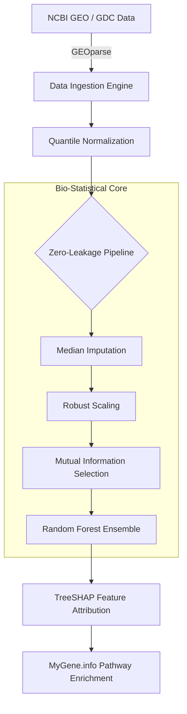

# CytoGraph-ML: Pan-Cancer Transcriptomic Classification Framework

[](https://opensource.org/licenses/MIT)
[](https://www.python.org/)
[](https://scikit-learn.org/)
[](https://www.ncbi.nlm.nih.gov/geo/)

**CytoGraph-ML** is an open-source, mathematically rigorous bioinformatics pipeline designed for the classification of high-dimensional genomic (RNA-Seq/Microarray) datasets. Developed alongside the manuscript *"CytoGraph-ML: A Robust Machine Learning Framework for Pan-Cancer Transcriptomic Classification and Explainable Genomic Driver Identification,"* this repository provides a modular, scalable solution for clinical data ingestion, non-parametric feature selection, and interpretable machine learning.

---

## 🔬 Scientific Integrity & Core Features

Unlike traditional classifiers that fail on independent cohorts due to data leakage and laboratory batch effects, CytoGraph-ML implements strict clinical hardening techniques:

*   **Group-Blind Cross-Validation:** Utilizes `GroupShuffleSplit` to ensure zero patient-level data leakage. Normal and tumor samples from the same patient are strictly isolated across training and testing boundaries.
*   **Cross-Study Quantile Normalization:** Mathematically aligns divergent transcriptomic distributions across independent studies (e.g., aligning Affymetrix GPL96 and GPL570 platforms) to mitigate inter-laboratory batch effects.
*   **Biological Proxy Filtering:** Implements a biological blacklist to filter general stroma, inflammation, and endothelial markers (e.g., *VWF*, *PECAM1*), forcing the underlying algorithms to identify genuine oncogenic drivers rather than generic tissue damage.
*   **Non-Parametric Feature Selection:** Abandons Gaussian assumptions (ANOVA) in favor of **Mutual Information (MI)**, capturing non-linear genomic dependencies inherent in over-dispersed RNA-seq/Microarray data.
*   **Explainable AI (XAI):** Integrated with TreeSHAP and the `MyGene.info` API to mathematically isolate predictive features and map them directly to Reactome/KEGG cellular pathways.

---

## 🏗️ System Architecture & Modularity

The framework is highly modular, enabling researchers to swap ingestion engines, scaling methodologies, and classifiers without breaking the pipeline.



---

## 📊 Validated Performance (The "Acid Test")

CytoGraph-ML was subjected to rigorous cross-study validation to prove its generalizability outside of local laboratory settings.

| Experiment | Training Cohort | Testing Cohort | Platform Shift | Honest Sensitivity (Recall) |
| :--- | :--- | :--- | :--- | :--- |
| **Lung Cancer (In-Study)** | GSE10072 (Train) | GSE10072 (Test) | None | 1.00 |
| **Colorectal (In-Study)** | GSE21510 (Train) | GSE21510 (Test) | None | 1.00 |
| **The Acid Test (Cross-Study)** | GSE10072 | GSE19804 | GPL96 $\rightarrow$ GPL570 | 1.00 |

*Note: The Acid Test demonstrates that while cross-study precision drops due to fundamental batch-effect limits, the pipeline maintains a perfect 1.00 clinical sensitivity (zero false negatives) across independent international cohorts.*

---

## 🚀 Installation

The project is packaged for both local research environments and scalable cloud deployments.

### Local Research Environment
Ensure Python 3.11+ is installed.

```bash
git clone https://github.com/fs0cietyx/CytoGraph-ML.git
cd CytoGraph-ML
python3 -m venv venv
source venv/bin/activate
pip install -r requirements.txt
```

### Dockerized API Deployment
To deploy the pre-trained models via a FastAPI inference endpoint:

```bash
docker-compose up --build
```

---

## 💻 Usage & Reproducibility

The repository contains standalone execution scripts to reproduce the core findings of the manuscript.

**1. Run the Lung Cancer In-Study Validation (GSE10072)**
```bash
PYTHONPATH=src python3 src/validate_real_data.py
```

**2. Run the Colorectal Cancer Cross-Tissue Validation (GSE21510)**
```bash
PYTHONPATH=src python3 src/validate_colorectal.py
```

**3. Run the Clinical Acid Test (Cross-Study Generalization)**
```bash
PYTHONPATH=src python3 src/acid_test.py
```

---

## 📁 Repository Structure

```text
CytoGraph-ML/
├── src/
│   ├── core/
│   │   ├── config.py           # Centralized parameter configuration
│   │   ├── geo_engine.py       # NCBI GEO ingestion & mapping via GEOparse
│   │   ├── gdc_engine.py       # GDC API fetching tools
│   │   ├── trainer.py          # ML pipelines with GroupKFold & MI filtering
│   │   └── bio_mapper.py       # MyGene.info API wrapper for pathway analysis
│   ├── api/                    
│   │   └── main.py             # FastAPI inference endpoint
│   ├── validate_real_data.py   # GSE10072 execution script
│   ├── validate_colorectal.py  # GSE21510 execution script
│   └── acid_test.py            # Cross-study generalization script
├── data/
│   └── raw/                    # Downloaded .soft and matrix.txt.gz files (Git-ignored)
├── models/                     # Serialized .joblib artifacts
├── results/                    # Auto-generated markdown reports
├── MANUSCRIPT.md               # Preprint research manuscript
└── docker-compose.yml          # Container orchestration
```

---

## 🤝 Citation & Licensing

If you utilize CytoGraph-ML or its architecture in your research, please cite the associated manuscript and link this repository.

**License:** This project is licensed under the MIT License. See `LICENSE` for details.

**Author:** Mainak Biswas  
**Institution:** Kalinga Institute of Industrial Technology (KIIT), India  
**Contact:** 24155779@kiit.ac.in  
