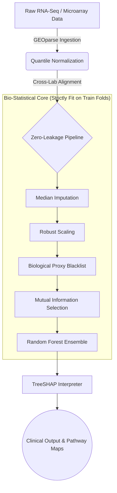

# CytoGraph-ML
Leakage-aware explainable machine learning framework for transcriptomic cancer classification.

## 🧬 Reproduce Paper
To replicate all CV scores, external generalizability tests, permutation audits, ablation sweeps, and generate publication-ready figures:

```bash
git clone https://github.com/mainakbiswas/cytograph-ml.git
cd cytograph-ml
python3 -m venv venv
source venv/bin/activate  # On Windows: venv\Scripts\activate
pip install -r requirements.txt
python scripts/reproduce_paper.py
```

## 📊 Data
This framework evaluates model robustness across three NCBI Gene Expression Omnibus (GEO) microarrays:
- **GSE10072**: Primary training cohort (Platform GPL96)
- **GSE19804**: External validation cohort (Platform GPL570)
- **GSE21510**: External colorectal tissue shift cohort (Platform GPL570)

## 📈 Results
- **Expected CV Accuracy:** `97.78%`
- **Expected External Accuracy:** `50.00%` (Unaligned Baseline) / `85.83%` (Hardened Model)

---

## 📖 Executive Summary
Every cell in the human body contains roughly 20,000 genes. You can think of these genes as "volume dials" on an audio mixer. In healthy cells, the dials are perfectly balanced. In cancer cells, these dials get scrambled—some are turned up dangerously high (promoting rapid cell division), while others are muted (turning off the body's natural defenses). 

Most AI models in genomics suffer from "Lab Bias" (Batch Effects). If an AI is trained on patients from a hospital in New York using one brand of sequencing equipment, it often fails catastrophically when analyzing a patient from a hospital in London using different equipment. The AI accidentally learns the "noise" of the hospital's machines rather than the actual biology of the disease. 

**Our Solution (CytoGraph-ML):** We built a computational pipeline that acts as a universal translator. It mathematically strips away the laboratory noise, filters out generic biological "smoke" (like inflammation), and forces the AI to lock onto the genuine oncogenic "fire."

---

## 🛡️ Leakage-Aware Architecture
Standard linear pipelines leak information when normalization or feature selection is fit globally. CytoGraph-ML uses a strictly segmented fit-transform architecture:



---

## 📁 Repository Structure
```text
cytograph-ml/
├── configs/             # YAML configurations (Never hardcode parameters)
├── data/                # Separated raw, processed, and metadata schemas
├── notebooks/           # Exploratory work only
├── src/                 # Framework core modules
│   ├── preprocessing/   # Single-responsibility data operations
│   ├── models/          # Model factory and base wrappers
│   ├── pipelines/       # Scikit-learn Pipeline builders
│   ├── validation/      # Validation protocols (GroupKFold, permutation, etc.)
│   ├── explainability/  # SHAP calculations and pathway rollups
│   ├── evaluation/      # Standard clinical metrics
│   ├── visualization/   # Publication-ready plotting scripts
│   └── utils/           # Shared IO and logging utilities
├── tests/               # Pytest unit and leakage boundary tests
├── docs/                # Extended markdown documentation
├── results/             # Auto-generated CSVs and raw reports
├── figures/             # Final paper-ready figures
├── models/              # Serialized joblib pipelines
└── scripts/             # Entrypoint scripts for paper reproduction
```

---

## ⚠️ Clinical Disclaimer
**FOR RESEARCH USE ONLY (RUO). NOT FOR USE IN DIAGNOSTIC PROCEDURES.**
CytoGraph-ML is a scientific research prototype. It has not been approved by the FDA or any other regulatory body. Under no circumstances should this software be used to diagnose, treat, or monitor any patient.
