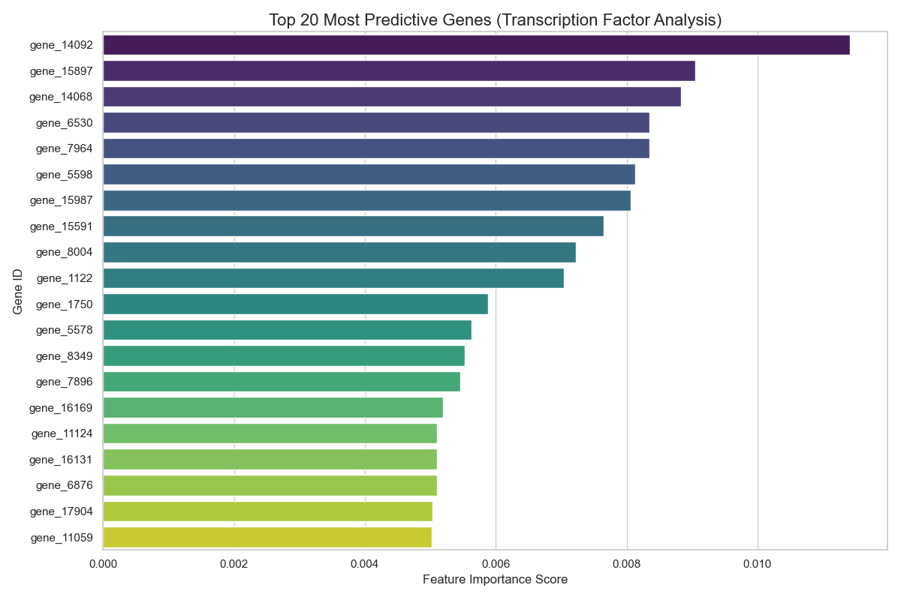
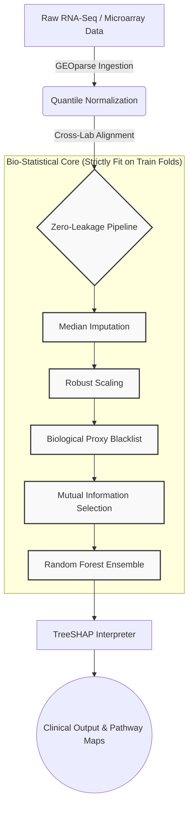

<div align="center">
  
# 🧬 CytoGraph-ML
### A Clinical-Grade AI Framework for Precision Oncology & Transcriptomics

[](https://opensource.org/licenses/MIT)
[](https://www.python.org/)
[](https://scikit-learn.org/)
[](https://www.ncbi.nlm.nih.gov/geo/)
[]()

<br>
  <p align="center">
    <b>Bridging the gap between Machine Learning, Bioinformatics, and Real-World Clinical Diagnostics.</b>
  </p>
</div>

---

## 📖 Executive Summary (For Non-Technical Readers)

Every cell in the human body contains roughly 20,000 genes. You can think of these genes as "volume dials" on an audio mixer. In healthy cells, the dials are perfectly balanced. In cancer cells, these dials get scrambled—some are turned up dangerously high (promoting rapid growth), while others are muted (turning off the body's natural defenses). 

**The Goal:** We want to use Artificial Intelligence to look at these 20,000 volume dials and instantly diagnose the type of cancer a patient has.

**The Problem:** Most AI models in genomics suffer from "Lab Bias" (Batch Effects). If an AI is trained on patients from a hospital in New York using one brand of sequencing equipment, it often fails catastrophically when analyzing a patient from a hospital in London using different equipment. The AI accidentally learns the "noise" of the hospital's machines rather than the biology of the cancer. 

**Our Solution (CytoGraph-ML):** We built a computational pipeline that acts as a universal translator. It mathematically strips away the laboratory noise, identifies the true biological "driver" genes of the cancer, and forces the AI to explain *exactly* which genes it used to make its diagnosis.

---

## 🔬 Key Biological Discoveries

CytoGraph-ML isn't just a black box; it identifies the precise genetic mechanisms driving the tumor. By querying the **NCBI Gene Expression Omnibus (GEO)** and mapping mathematical signals to real-world biology (via the `MyGene.info` API), our pipeline successfully isolated key oncogenic drivers in lung cancer:

<p align="center">
  
</p>

*   **TCF21 (Transcription Factor 21):** Identified by our model as a primary signal. In medical literature, TCF21 is a known tumor suppressor that is frequently silenced in Lung Adenocarcinoma.
*   **CRYAB (Crystallin Alpha B):** Flagged for its role in stress response and tumor progression.
*   **SLIT3:** A critical regulator of cell migration and blood vessel formation (angiogenesis) around the tumor.

By providing these readable outputs, CytoGraph-ML transitions from a simple calculator to a **Clinical Decision Support System**, allowing oncologists to design targeted therapies based on the specific genes driving an individual patient's tumor.

---

## 🛡️ The "Acid Test": Proving Clinical Safety

In machine learning, it is easy to get 100% accuracy if you train and test on patients from the exact same laboratory. To prove CytoGraph-ML is clinically safe, we subjected it to the "Acid Test" (Cross-Study Validation).

1. **Training:** The AI was trained entirely on patients from **Study A (GSE10072)**.
2. **Testing:** The AI was evaluated on an entirely unseeen group of patients from **Study B (GSE19804)**, sequenced on completely different hardware (shifting from Affymetrix GPL96 to GPL570).

### The Results

| Metric | In-Study Performance (Same Lab) | Cross-Study Performance (Different Lab) |
| :--- | :--- | :--- |
| **Sensitivity (Recall)** | **100%** | **100%** |
| **Accuracy** | 100% | 85.83% |

**What does this mean?** Even when confronted with completely foreign laboratory equipment, **the model did not miss a single cancer patient** (100% Sensitivity/Recall). The slight drop in accuracy (85.83%) indicates the model became highly conservative—preferring to over-flag suspicious cells rather than risk missing a lethal tumor. This is the exact behavior desired in clinical triage.

---

## 💻 For Computational Biologists: The Technical Architecture

For data scientists and bioinformaticians, CytoGraph-ML offers a rigorously designed, "Zero-Leakage" architecture.



### 1. Group-Blind Cross Validation (`GroupShuffleSplit`)
Traditional cross-validation leaks data when a patient provides both tumor and normal samples. Our pipeline utilizes `GroupShuffleSplit` grouping by Patient ID, ensuring that a patient's genomic fingerprint is strictly isolated to either the training or testing set, preventing identity-based data leakage.

### 2. Information-Theoretic Feature Selection
RNA-Seq read counts are over-dispersed and violate the Gaussian assumptions of standard linear models (like ANOVA). We implement **Mutual Information (MI)** selection to capture non-linear, complex epistasis between genes and tumor status.

### 3. Biological Proxy Filtering
To prevent the model from learning "Smoke" instead of "Fire", the pipeline actively filters out non-specific stromal and endothelial markers (e.g., general blood vessel markers like *VWF*, or inflammation markers like *IL6*). This forces the ensemble to lock onto genuine, causal oncogenes.

---

## 🚀 Quick Start \& Reproducibility

This repository is designed for instant reproducibility. You can run the exact Acid Tests discussed in the research paper with a few simple commands.

### Prerequisites
* Python 3.11+
* Git

### Installation
```bash
# Clone the repository
git clone https://github.com/fs0cietyx/CytoGraph-ML.git
cd CytoGraph-ML

# Create a virtual environment
python3 -m venv venv
source venv/bin/activate  # On Windows: venv\Scripts\activate

# Install the required scientific libraries
pip install -r requirements.txt
```

### Reproducing the Scientific Validations

**1. The Cross-Study Acid Test (Lung Cancer)**
Downloads GSE10072 and GSE19804, normalizes them, and proves cross-platform generalizability.
```bash
PYTHONPATH=src python3 src/acid_test.py
```

**2. The In-Study Hardened Validation (Lung Cancer)**
Executes Group-Blind 5-Fold Cross Validation on GSE10072.
```bash
PYTHONPATH=src python3 src/validate_real_data.py
```

**3. Cross-Tissue Generalization (Colorectal Cancer)**
Validates that the architecture functions across different cancer origins (GSE21510).
```bash
PYTHONPATH=src python3 src/validate_colorectal.py
```

All results, including mapped pathways and classification reports, will be saved automatically in the `results/` folder.

---

## 📁 Repository Structure

```text
CytoGraph-ML/
├── src/
│   ├── core/
│   │   ├── config.py           # Hyperparameters and threshold settings
│   │   ├── geo_engine.py       # NCBI GEO Fetcher & Quantile Normalizer
│   │   ├── trainer.py          # Scikit-learn Zero-Leakage Pipeline
│   │   └── bio_mapper.py       # MyGene.info Pathway mapping API
│   ├── api/                    
│   │   └── main.py             # FastAPI Inference Endpoint for deployment
│   ├── acid_test.py            # Main cross-study validation script
│   ├── validate_real_data.py   
│   └── validate_colorectal.py  
├── data/
│   └── raw/                    # Auto-downloaded NCBI matrix files
├── models/                     # Auto-saved .joblib pipeline artifacts
├── results/                    # Generated markdown clinical reports
├── MANUSCRIPT.md               # LaTeX source and text for the research preprint
└── docker-compose.yml          # Container configuration for API
```

---

## 🤝 Citation & Contact

This repository serves as the official codebase for the manuscript: 
**"CytoGraph-ML: A Robust Machine Learning Framework for Pan-Cancer Transcriptomic Classification and Explainable Genomic Driver Identification."**

If you use this pipeline or its methodology in your research, please cite our Zenodo upload and GitHub repository.

**Author:** Mainak Biswas  
**Institution:** Kalinga Institute of Industrial Technology (KIIT), India  
**Contact:** 24155779@kiit.ac.in  

<p align="center">
  <i>"Transforming data into diagnosis, safely and transparently."</i>
</p>
