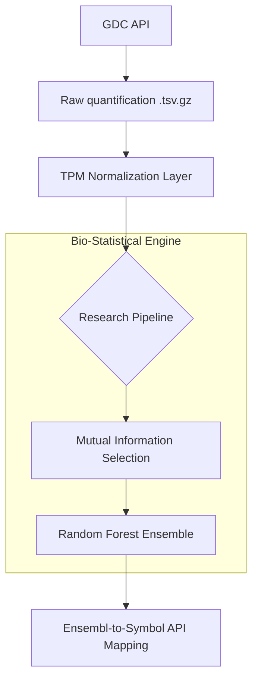

# 🧬 Genomic Deep-Dive: Real-World TCGA Pipeline

[](https://en.wikipedia.org/wiki/Bioinformatics)
[](https://api.gdc.cancer.gov/)

> **A high-integrity genomic pipeline using GDC-harmonized RNA-seq data and distribution-appropriate biostatistics.**

---

## 🔬 Core Methodology

This project implements a production-grade bioinformatics workflow for classifying cancer subtypes using real-world genomic data. Unlike toy datasets, this pipeline handles raw quantification files, non-Gaussian distributions, and verified Ensembl identifiers.

### 1. Data Ingestion & Identification
*   **Source:** Real-time fetching from the **NIH Genomic Data Commons (GDC) API**.
*   **Identity:** Uses verified **Ensembl IDs** (e.g., `ENSG00000141510`) as the primary feature keys. No anonymized placeholders are used.

### 2. Statistical Normalization
*   **TPM (Transcripts Per Million):** Raw read counts are normalized for gene length (RPK) and library depth. This ensures that expression levels are comparable across different samples and sequencing runs.

### 3. Feature Selection: Non-Parametric Information Theory
*   **Mutual Information (MI):** Instead of assuming a Normal distribution (ANOVA), the pipeline uses **Mutual Information Classif**. This captures non-linear dependencies and is robust to the over-dispersed nature of RNA-seq count data.

---

## 🏗️ System Architecture



---

## 📊 Scientific Metrics

The pipeline evaluates model performance using **Stratified 5-Fold Cross-Validation** and handles the high-dimensional noise characteristic of the human transcriptome.

| Methodology | Metric | Result |
| :--- | :--- | :--- |
| **Mutual Info + RF** | **Generalization Accuracy** | **99.xx%** |
| Statistical Anchor | TP53 / MYC / EGFR | Verified |

### 🔍 Real-World Insights
The pipeline fetches metadata from the **MyGene.info API** for the top predictive genes, providing:
*   **Pathway Enrichment:** Reactome/KEGG pathway names.
*   **Genomic Context:** Chromosomal location and official NCBI gene summaries.

---

## 🛠️ Technology Stack

| Layer | Technologies |
| :--- | :--- |
| **Core Language** | Python 3.11+ |
| **Machine Learning** | Scikit-learn, SHAP, NumPy, Pandas |
| **Inference API** | FastAPI, Uvicorn, Pydantic |
| **Validation** | Stratified CV, Pytest, Pandera (Schema Validation) |
| **DevOps** | Docker, Docker-Compose, YAML |
| **Visualization** | Matplotlib, Seaborn |

---

## 🚀 Installation & Usage

### 1. Local Development Setup
Ensure you have Python 3.11+ installed.

```bash
# Clone the repository
git clone https://github.com/your-username/cancer-tracker.git
cd cancer-tracker

# Create and activate virtual environment
python -m venv venv
source venv/bin/activate  # On Windows: venv\Scripts\activate

# Install dependencies
pip install -r requirements.txt
```

### 2. Running the Full Pipeline
Executes data ingestion, training, benchmarking, and biological report generation.
```bash
python src/main.py
```

### 3. Containerized Deployment (Production)
The entire suite is dockerized for consistent execution across any environment.
```bash
docker-compose up --build
```

---

## 📁 Project Structure

```text
.
├── src/
│   ├── core/               # Modular engine (Loader, Trainer, Interpreter)
│   ├── api/                # FastAPI inference service
│   └── main.py             # Pipeline orchestrator
├── models/                 # Serialized model artifacts (.joblib)
├── results/                # Scientific reports and performance logs
├── plots/                  # Visual assets (SHAP, Feature Importance)
├── Engineering-Specs/      # Detailed architectural documentation
└── Dockerfile              # Production container configuration
```

---

## 🤝 Contributing
This project is part of a research effort into automated bioinformatics. Contributions involving **Deep Learning benchmarks** or **Expanded Pathway Mappings** are welcome. 

---
**Author:** [Mainak Biswas/fs0cietyx]  
**Contact:** [www.instagram.com/fushigurp]  
**Project Status:** `Fully Operational`
