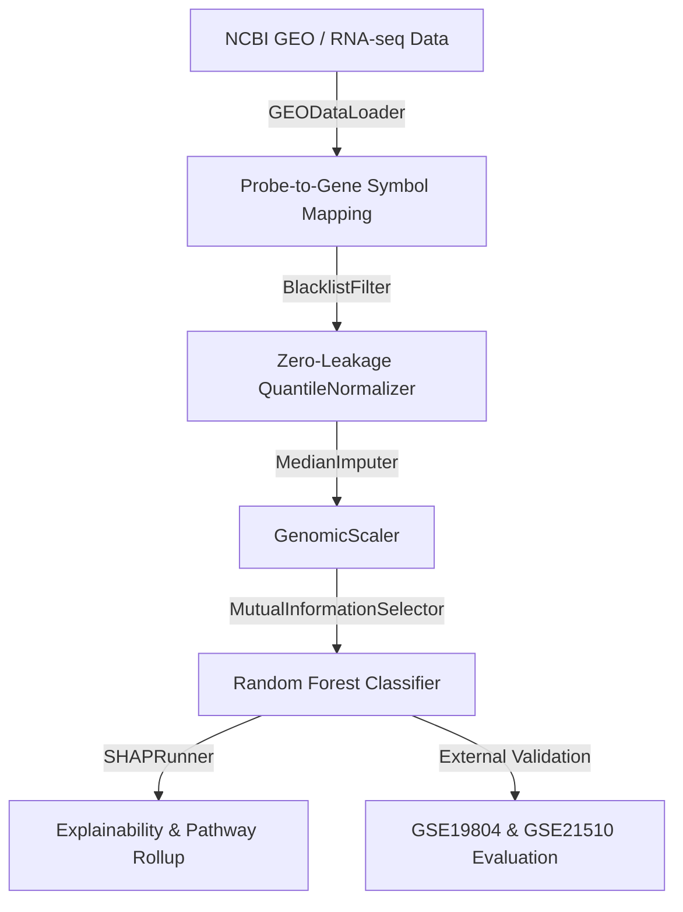

# CytoGraph-ML Technical Architecture

CytoGraph-ML is structured as a modular, high-integrity bioinformatics machine learning framework.

## System Flowchart

The data processing pipeline is implemented as a strict, zero-leakage scikit-learn `Pipeline` flow:

## Core Modules

1. **GEODataLoader** (`src/preprocessing/geo_loader.py`): Ingests dataset expression matrices and parses clinical phenotype data.
2. **GeneMapper** (`src/preprocessing/gene_mapper.py`): Standardizes probe IDs to official Gene Symbols.
3. **BlacklistFilter** (`src/preprocessing/blacklist.py`): Drops generic proxy biological signals (housekeeping, inflammatory genes) to force models onto oncogenic signals.
4. **QuantileNormalizer** (`src/preprocessing/quantile_norm.py`): Resolves distribution shifts between platforms in a fit-transform format to prevent validation leaks.
5. **MutualInformationSelector** (`src/preprocessing/feature_selection.py`): Selects the top $K$ features using information-theoretic scoring.
6. **ModelFactory** (`src/models/factory.py`): Instantiates classifiers with defined hyperparameter configurations.
